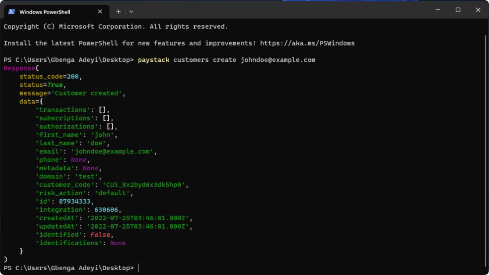

# Get Started

## Installation

<!-- tabs:start -->

#### **Npm**

```bash
npm i @gray-adeyi/paystack-sdk
```

#### **Yarn**

```bash
yarn i @gray-adeyi/paystack-sdk
```

#### **Pnpm**

```bash
pnpm i @gray-adeyi/paystack-sdk
```

#### **Bun**

```bash
bun add @gray-adeyi/paystack-sdk
```

#### **Deno**

```bash
deno add @gray-adeyi/paystack-sdk
```

<!-- tabs:end -->


## Usage

@gray-adeyi/paystack-sdk provides the `PaystackClient` class which provides all your 
paystack integration needs in your JS/TS project. on instantiation of an object of this
class, the `PaystackClient` will attempt to read your paystack secret key from your 
environmental variables with the name `PAYSTACK_SECRET_KEY`, if it doesn't find the
key, it falls back to the optional `secretKey` params passed to the class constructor on instantiation.
It's important to note that the `secretKey` params takes precedence to the environmental
variable. In the absence of the secret key in both the params and environmental variable,
a `PaystackClientError` is thrown. All client methods too may throw a `PaystackClientError`.
See [Examples](./examples.md) for more

### In your JS project
```js
// In your JS project that still uses CommonJS(CJS), you can use the sdk like so
const paystack = require('@gray-adeyi/paystack-sdk')

const client = new paystack.PaystackClient('<your-secret-key>') // You may omit your secret key if it's set in the environmental variables

// Example getting banks
client.miscellaneous.getBanks(paystack.Country.NIGERIA).then(console.log)

// The typical format to every client method is client.[sub-client-binding-name].[method]
// For example
client.plans.getPlans().then((response) => {
    // use the response.
})
```

### In your TS project
```ts
import {
  Country,
  PaystackClient,
  type PaystackResponse,
} from "@gray-adeyi/paystack-sdk";


const client = new PaystackClient(); // You may omit your secret key if it's set in the environmental variables

const response: PaystackResponse = await client.miscellaneous.getBanks({ country: Country.NIGERIA })

console.log(response)

// As at the time of this writing, @paystack-sdk/gray-adeyi does not infer the type of the
// response data, all client methods return a `PaystackResponse` object. To continue
// to benefit from typescript's type inference, you'll have to explicitly define the
// types of your response data. for example to use the data of the 
// `client.miscellaneous.getBanks`, we may define a `BankData` type as show below

type BankData = {
    readonly id: number;
    readonly name: string;
    readonly slug: string;
    readonly code: string;
    readonly longcode: string;
    readonly gateway: string | null;
    readonly payWithBank: boolean;
    readonly supportsTransfer: boolean;
    readonly active: boolean;
    readonly country: string;
    readonly currency: string;
    readonly type: string;
    readonly isDeleted: boolean;
    readonly createdAt: string | null;
    readonly updatedAt: string | null;
}

const res = await client.miscellaneous.getBanks({country: Country.NIGERIA})
const data = res.data as BankData[];
// data now has all the type information.

```


## CLI

While developing, it can be sometimes necessary to see the response data as a result of calling an endpoint. If we were consuming paystack API directly, tools like Postman or
bruno would have been handy. With the client method abstraction layer over the API, we
might have to do multiple `console.log` to see the response data. There's also the
overhead of needing to write the code that yields this response data. To see this
response data without having to write a prototype code, a CLI might be handy.

We can leverage on `Paystack CLI` from the python's ecosystem. We don't need to install
or know how to install python, the scripts in the installation guide does everything
for you.



### Install Paystack CLI
<!-- tabs:start -->

#### **Windows**

```powershell
powershell -c "irm https://raw.githubusercontent.com/gray-adeyi/paystack-sdk/main/install-cli.ps1 | iex"

```

#### **Mac & Linux**

```bash
curl -LsSf https://raw.githubusercontent.com/gray-adeyi/paystack-sdk/main/install-cli.sh | sh
```

<!-- tabs:end -->

### Using Paystack CLI

For the first time using the CLI, you want to configure it to use your secret key. this can
be achieved by running the command below.
```bash
paystack config <YOUR-SECRET-KEY>
```
You can remove your secret key from the cli by running

```bash
paystack reset
```

### Example

To retrieve a single transaction from your integration with the cli, you can run

```bash
paystack txn get-txns --pagination 1
```
You should get a response in your stdout if the request is successful (Note: the command
above requires a working internet connection) similar to the one below

```bash
Response(
    status_code=200,
    status=True,
    message='Transactions retrieved',
    data=[
        {
            'id': 3785557723,
            'domain': 'test',
            'status': 'success',
            'reference': '2769088ddc23d52947c8e845f6a6bbdebd987f457e97f71c',
            'amount': 30000,
            'message': None,
            'gateway_response': 'Approved',
            'paid_at': '2024-05-11T10:00:29.000Z',
            'created_at': '2024-05-11T10:00:27.000Z',
            'channel': 'card',
            'currency': 'NGN',
            'ip_address': None,
            'metadata': {'invoice_action': 'create'},
            'log': None,
            'fees': 450,
            'fees_split': None,
            'customer': {'id': 47948280, 'first_name': 'Gbenga', 'last_name': 'Adeyi', 'email': 'coyotedevmail@gmail.com', 'phone': '', 'metadata': None, 'customer_code': 'CUS_73cb3biedlkbe4a', 'risk_action': 'default'},
            'authorization': {
                'authorization_code': 'AUTH_w1renosr9o',
                'bin': '408408',
                'last4': '4081',
                'exp_month': '12',
                'exp_year': '2030',
                'channel': 'card',
                'card_type': 'visa ',
                'bank': 'TEST BANK',
                'country_code': 'NG',
                'brand': 'visa',
                'reusable': True,
                'signature': 'SIG_JOdryeujwrsZryg0Lkrg',
                'account_name': None
            },
            'plan': {},
            'split': {},
            'subaccount': {},
            'order_id': None,
            'paidAt': '2024-05-11T10:00:29.000Z',
            'createdAt': '2024-05-11T10:00:27.000Z',
            'requested_amount': 30000,
            'source': {'source': 'merchant_api', 'type': 'api', 'identifier': None, 'entry_point': 'charge'},
            'connect': None,
            'pos_transaction_data': None
        }
    ]
)
```

We might only be interested in the in the json data and not the fancy python class, an just
want a `JSON` dump of the response data, we can achieve this by adding a `--data-only` suffix
to any of the CLI command. So to retrieve a `JSON` equivalent of the result above, we can
run the command below

```bash
paystack txn get-txns --pagination 1 --data-only
```

Which results in

```json
[{"id": 3785557723, "domain": "test", "status": "success", "reference": "2769088ddc23d52947c8e845f6a6bbdebd987f457e97f71c", "amount": 30000, "message": null, "gateway_response": "Approved", "paid_at": "2024-05-11T10:00:29.000Z", "created_at": 
"2024-05-11T10:00:27.000Z", "channel": "card", "currency": "NGN", "ip_address": null, "metadata": {"invoice_action": "create"}, "log": null, "fees": 450, "fees_split": null, "customer": {"id": 47948280, "first_name": "John", "last_name": "Doe", "email": 
"johndoe@example.com", "phone": "", "metadata": null, "customer_code": "CUS_73cb3biedlkbe4a", "risk_action": "default"}, "authorization": {"authorization_code": "AUTH_w1renosr9o", "bin": "408408", "last4": "4081", "exp_month": "12", "exp_year": "2030", 
"channel": "card", "card_type": "visa ", "bank": "TEST BANK", "country_code": "NG", "brand": "visa", "reusable": true, "signature": "SIG_JOdryeujwrsZryg0Lkrg", "account_name": null}, "plan": {}, "split": {}, "subaccount": {}, "order_id": null, "paidAt": 
"2024-05-11T10:00:29.000Z", "createdAt": "2024-05-11T10:00:27.000Z", "requested_amount": 30000, "source": {"source": "merchant_api", "type": "api", "identifier": null, "entry_point": "charge"}, "connect": null, "pos_transaction_data": null}]
```

You may choose to pipe your response into a file by adding ` > file-name.json` to the end of
your command. The current limitation of the CLI is that we don't get the key transformation
as we do from the SDK, so key names like `created_at`, `card_type`, `order_id` should translate to `createAt`, `cardType`, and `orderId` in you JS/TS project.

To see other commands available in the CLI, run `paystack --help`, to see subcomands available
in the CLI run `paystack command --help` e.g. `paystack apple-pay --help`. Reference the additional resources for more guide on how to use the CLI

### Additional Resources for Paystack CLI

- [Paystack CLI Documentation](https://pypi.org/project/paystack-cli/)
- [Installing paystack cli via pip on windows](https://youtu.be/JWWkTwER9xg?si=bhwa89qXLaS6aqPu)
- [Installing paystack cli on windows from binaries](https://youtu.be/N8TfuJJ9ycI?si=2VHIf133IuwTNCXB)
- [How to use paystack cli](https://youtu.be/GuYtyh1Ew5E?si=SXjZU1NAfs8mhOJ2)